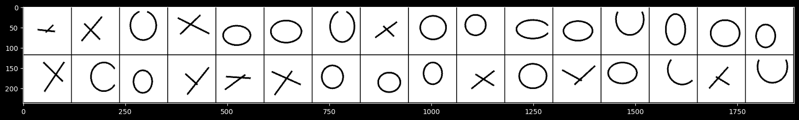
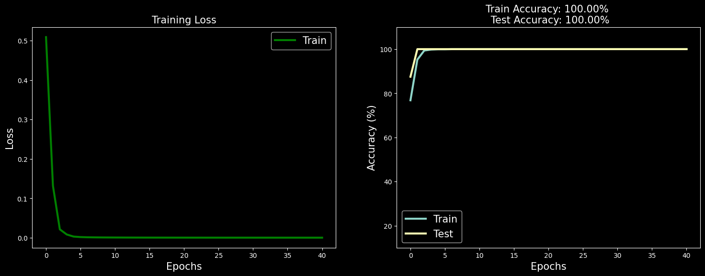

# Convolutional Neural Network (CNN) for Image Classification

This project implements a Convolutional Neural Network (CNN) to classify images from a dataset using PyTorch. The dataset is split into training and testing sets, and the model is trained to recognize different classes of images.

## Overview

This CNN model is built using PyTorch and includes the following features:
- Data loading and preprocessing using `torchvision`.
- Custom CNN architecture with convolutional and fully connected layers.
- Training and evaluation processes with accuracy tracking.
- Visualization of training loss and accuracy.

## Installation

1. **Clone the repository:**
   ```bash
   git clone <URL>
   cd NLP



