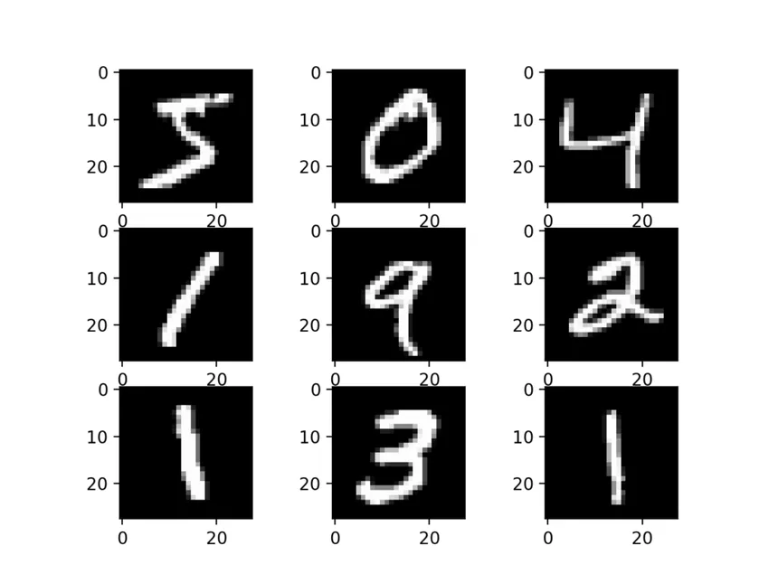
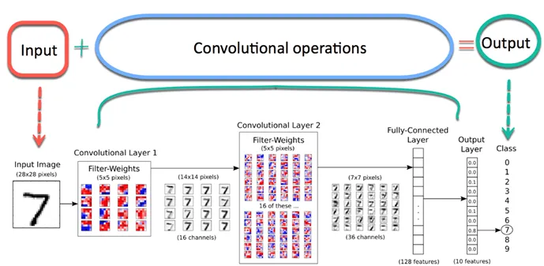
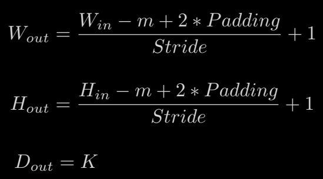
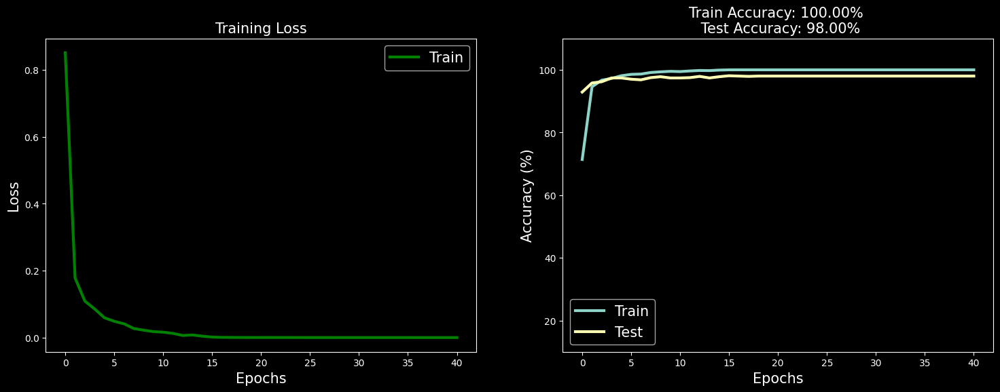

# Convolutional Neural Network (CNN) for MNIST Digit Classification

This project implements a Convolutional Neural Network (CNN) to classify handwritten digits from the MNIST dataset using PyTorch. The model is trained on a subset of the MNIST training data and is capable of recognizing digits from 0 to 9.

## Table of Contents
- [Overview](#overview)
- [Installation](#installation)
- [Usage](#usage)
- [Model Architecture](#model-architecture)
- [Results](#results)
- [License](#license)

## Overview

This CNN model uses PyTorch to classify images of handwritten digits from the MNIST dataset. Key features include:
- Data preprocessing and normalization.

- A custom CNN architecture with convolutional and fully connected layers.

- Training and evaluation with accuracy tracking. 
- Visualization of training loss and accuracy.

## Installation of libraries
