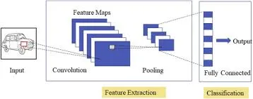
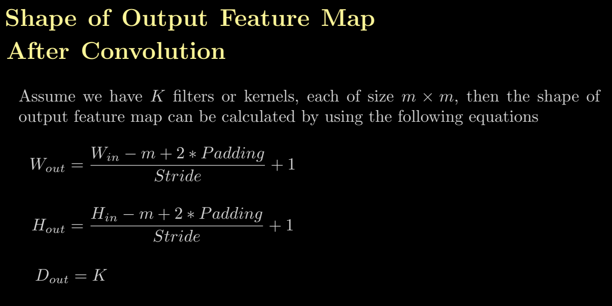

# Convolutional and Transpose Convolution Layers in PyTorch and TensorFlow

This project provides a comprehensive overview of how to implement and understand convolutional layers, transposed convolutional layers, and max pooling layers using both PyTorch and TensorFlow. It includes code snippets and explanations for each operation.

## Table of Contents

- [Overview](#overview)
- [Requirements](#requirements)

- [PyTorch Implementation](#pytorch-implementation)
  - [Convolutional Layer](#convolutional-layer)
  
  - [Transposed Convolutional Layer](#transposed-convolutional-layer)
  - [Max Pooling Layer](#max-pooling-layer)
  - [Flattening](#flattening)
- [TensorFlow Implementation](#tensorflow-implementation)
  - [Convolutional Layer](#tensorflow-convolutional-layer)
  - [Transposed Convolutional Layer](#tensorflow-transposed-convolutional-layer)
  - [Max Pooling Layer](#tensorflow-max-pooling-layer)
  - [Custom Padding](#custom-padding)

## Overview

This repository contains code that demonstrates how to implement:
- **Convolutional Layers**: Extract features from images.
- **Transposed Convolutional Layers**: Upsample feature maps.
- **Max Pooling Layers**: Reduce the dimensionality of feature maps.
- **Flattening**: Convert multi-dimensional tensors into one-dimensional.

Both PyTorch and TensorFlow implementations are provided to illustrate the differences and similarities between the two frameworks.
