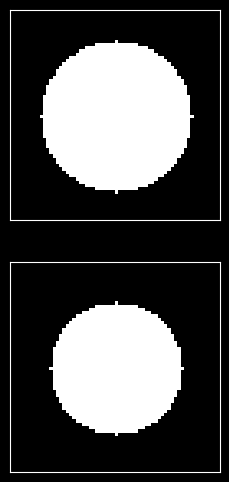
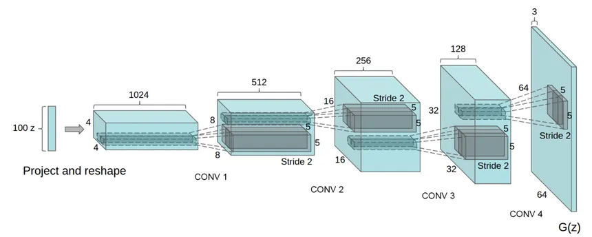
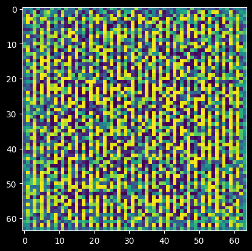

# DCGAN for Grayscale Image Generation

This project implements a Deep Convolutional Generative Adversarial Network (DCGAN) using PyTorch to generate grayscale images. The images represent frequency domain low-pass filters of size 64x64, and the model consists of a generator and a discriminator.

## Table of Contents

- [Overview](#overview)
- [Requirements](#requirements)
- [Dataset Generation](#dataset-generation)

- [Model Architecture](#model-architecture)
  
  - [Discriminator](#discriminator)
  - [Generator](#generator)
  
- [Training](#training)
- [Loss and Performance Visualization](#loss-and-performance-visualization)
- [Testing the Generator](#testing-the-generator)

## Overview

The objective of this project is to train a DCGAN to generate realistic-looking low-pass filter images. The generator creates fake images, while the discriminator evaluates them against real images. The two models compete against each other, improving their performance over time.

## Requirements

To run the code in this project, you need to have the following Python libraries installed:

- PyTorch
- NumPy
- Matplotlib

You can install the required libraries using pip:

```bash
pip install torch torchvision numpy matplotlib
