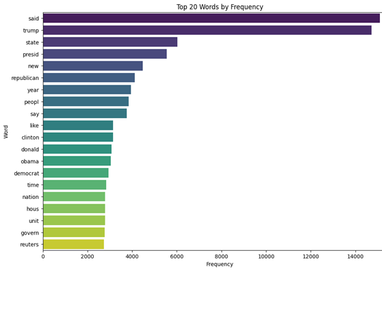

# Overview
This .ipynb file contains the code for detection of fake and real news using the news dataset as sample size.
Datasets Used:
True.csv: Contains true news articles. 
Fake.csv: Contains fake news articles.
Data Description:
Sample Size: 5000 articles (balanced between true and fake).
Features: Text of the article (title and other metadata removed).
## Data Preprocessing
Steps Taken:
Column Removal: Removed title, subject, and date.
Text Cleaning: Applied stemming to normalize text.
Sample Reduction: Reduced dataset size to manage memory (sample size of 5000).
Text Processing:
Used NLTK’s Porter Stemmer.
Removed stopwords from the text.

The below image is the distributionn by category

## Feature Extraction
Techniques Used:
CountVectorizer: Extracted word counts with n-grams (1, 2).
TfidfVectorizer: Converted text to term frequency-inverse document frequency.
## Model Architecture
CNN Model:
Layers: Embedding, Conv1D, MaxPooling1D, Flatten, Dense
Activation: ReLU and Sigmoid
Optimizer: Adam
LSTM Model:
Layers: Embedding, LSTM, Dense
Activation: ReLU and Sigmoid
Optimizer: Adam
### Results for model performance

