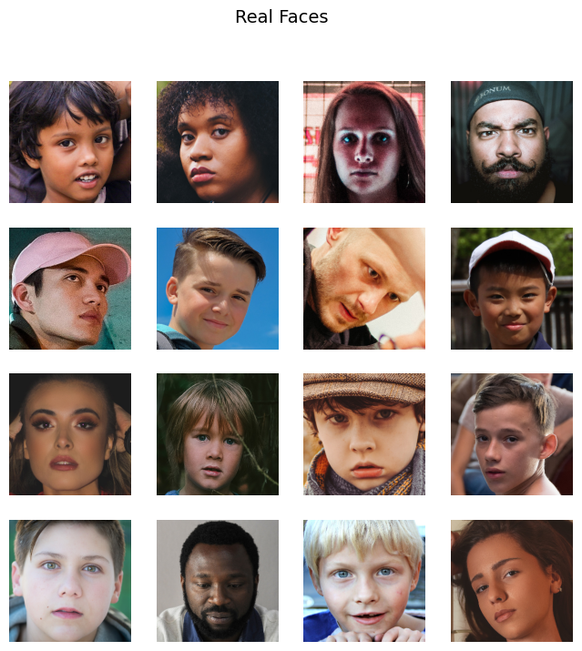
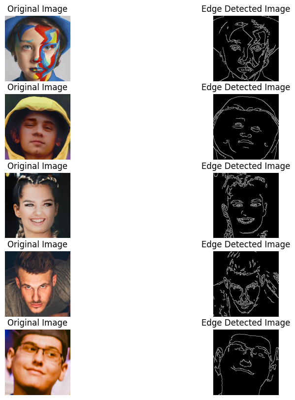
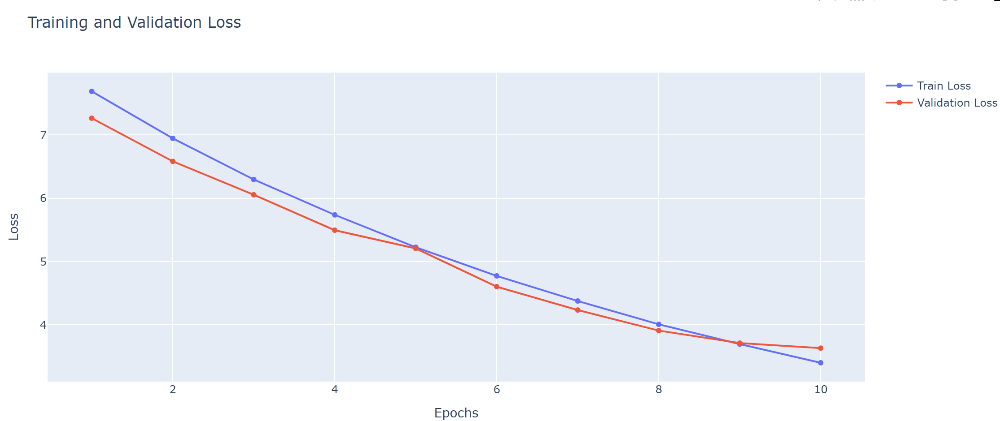
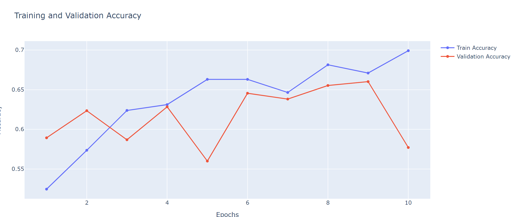

# Real vs Fake Face Classification

This project implements a convolutional neural network using TensorFlow and Keras to classify images of faces as either real or fake. It utilizes MobileNetV2 for transfer learning and incorporates various techniques for data augmentation and model training.

## Table of Contents
- [Installation](#installation)
- [Dataset](#dataset)


- [Model Architecture](#model-architecture)
- [Training Process](#training-process)
- [Results](#results)
- [Visualization](#visualization)



## Installation

To run this project, you will need to install the necessary libraries. You can install TensorFlow with the following command:

```bash
!pip install tensorflow
