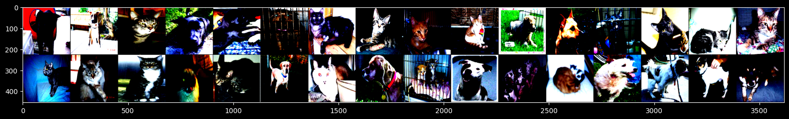
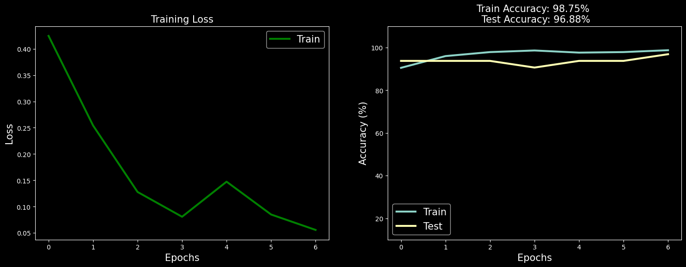

# Cats vs Dogs Classification Using AlexNet

This project implements a deep learning model to classify images of cats and dogs using the AlexNet architecture. The dataset is split into training and testing sets, and the model is trained to distinguish between the two classes.

## Table of Contents
- [Installation](#installation)
- [Dataset](#dataset)

- [Usage](#usage)
- [Model Architecture](#model-architecture)
- [Training Process](#training-process)
- [Results](#results)
- [Visualization](#visualization)

- [License](#license)

## Installation

To set up the environment, make sure to install the required libraries. You can do this by running:

```bash
!pip install split-folders
