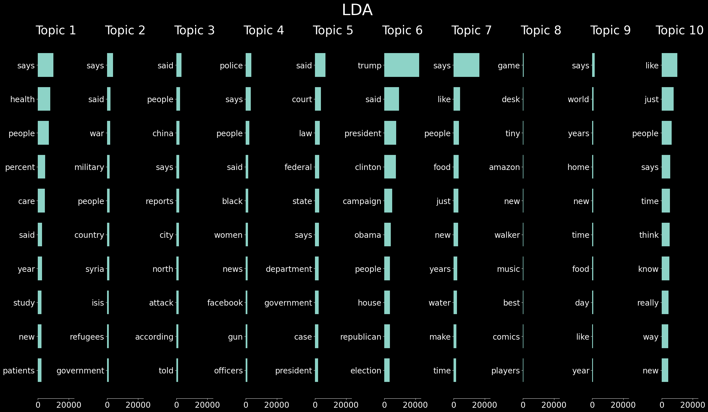
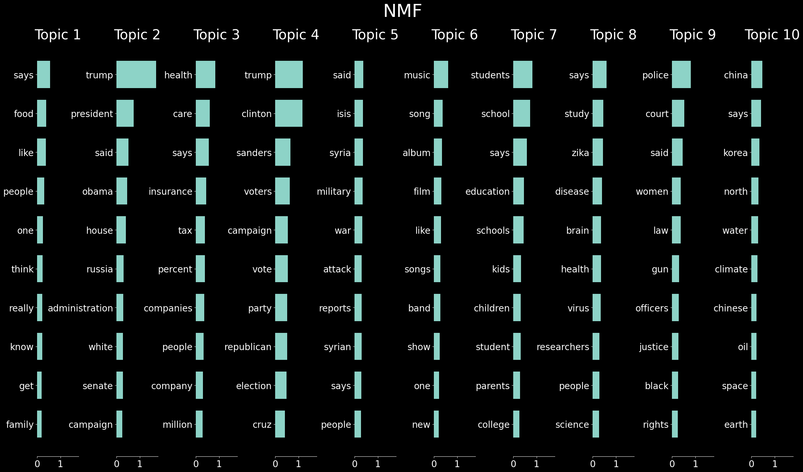

# National Radio Topic Modeling with LDA and NMF
This file explores topic modeling techniques on the National Radio (NPR) dataset. The goal is to identify and categorize the content of NPR articles into meaningful topics.
## Data
Source: The dataset is assumed to be provided and downloaded from a source other than www.npr.org (due to legal restrictions).
Structure: The dataset is expected to have a single column containing textual content of NPR articles.
## Topic Modeling
Latent Dirichlet Allocation (LDA):
Implement LDA to identify latent topics within the text corpus.
## Non-negative Matrix Factorization (NMF):
Implement NMF as an alternative topic modeling approach

### Benefits
Topic modeling helps uncover underlying themes and patterns within the NPR dataset.
This allows for better understanding of the content covered by NPR and facilitates content exploration based on specific topics.

