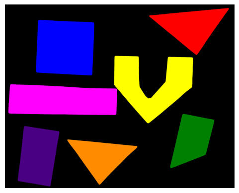

# Connected Components Analysis

This project implements connected components analysis on images using Python libraries such as `skimage`, `numpy`, and `matplotlib`. The analysis identifies and labels distinct objects in a binary image.

## Table of Contents
- [Installation](#installation)
- [Usage](#usage)
- [Functionality](#functionality)
- [Results](#results)


- [License](#license)

## Installation

To run this project, ensure you have the necessary libraries installed. You can install the required packages using the following commands:

```bash
!pip install ipympl imageio[ffmpeg] scikit-image matplotlib
