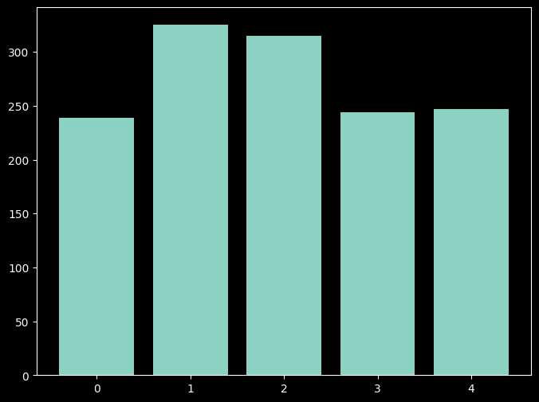

# Project Overview
This project demonstrates text classification using the BBC News dataset. The goal is to classify text documents into their respective categories (e.g., business, politics, sports) using machine learning models.

## Data Preparation
Load the BBC News dataset: Import the necessary libraries (e.g., pandas, scikit-learn) and load the dataset.
Preprocess the text: Perform tasks like tokenization, stop word removal, and stemming/lemmatization to prepare the text for analysis.

## Feature Extraction
TF-IDF Vectorization: Use the TF-IDF (Term Frequency-Inverse Document Frequency) vectorizer to convert text documents into numerical representations.
Experiment with parameters: Explore different stop word lists and tokenizers to optimize feature extraction.
Model Training and Evaluation
### Probabilistic Models:
Naive Bayes: Train a Naive Bayes classifier on the vectorized data.
Logistic Regression: Train a Logistic Regression classifier on the vectorized data.
### Non-Probabilistic Model:
Perform using SUpport Vector and random forest and train it on the vectorized data.
### Evaluation:
Calculate accuracy for each model using appropriate evaluation metrics.

### Libraries and Tools
Pandas: For data manipulation and analysis.
NLTK: For natural language processing tasks like tokenization and stop word removal.
Scikit-learn: For machine learning algorithms and evaluation metrics.
TF-IDF Vectorizer: For feature extraction.